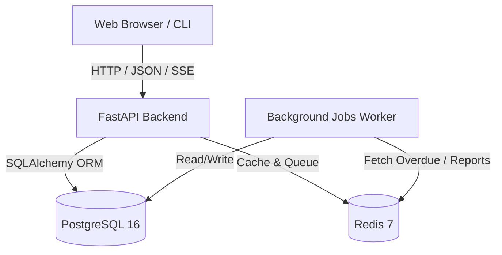

# 📚 Library Management System (LMS)
A modern, production-grade **Library Management System** built with a clean, layered architecture. It features a high-performance Python FastAPI backend, an interactive real-time React web application, a robust database layer (PostgreSQL & Redis), an asynchronous background worker system for overdue loan tracking, and a developer-friendly Command-Line Interface (CLI).

---

## 📖 Project Explanation & Component Breakdown

This Library Management System is built using a modern **monorepo architecture** where the frontend, backend, CLI, and database are structured to work together seamlessly. Below is an explanation of each component and how they interact:

### 1. Frontend Client (React & Vite)
*   **Role**: The client-side web application interface.
*   **Technology**: React 18+, Vite (as build tool/bundler), Vanilla CSS design tokens with Glassmorphism, and SVG vector art rendering.
*   **Purpose**: Provides an interactive dashboard for members and librarians. It includes a **side-by-side layout** ("Recommended for You" & "Quick Actions"), **handcrafted vector illustrated book covers** (1:1.48 portrait proportions), full-screen centered modal dialogs for active loans, borrowing history, and saved favorites, and a real-time Server-Sent Events (SSE) notification bell.

### 2. Backend Server (FastAPI)
*   **Role**: The central coordinator and data provider.
*   **Technology**: FastAPI (Python 3.11+), SQLAlchemy 2.0 (ORM), and Pydantic v2 (data modeling and schema validation).
*   **Purpose**: Exposes a secure, high-performance RESTful API. It processes incoming requests from the React frontend and CLI client, handles user authentication/authorization (JWT tokens via `python-jose` and `bcrypt`), performs business logic validations, and executes transactions on the database.

### 3. Database Layer (PostgreSQL & Alembic)
*   **Role**: Persistent relational data storage.
*   **Technology**: PostgreSQL 16.
*   **Purpose**: Stores structured records for books, users, library members, active/completed loans, and notification logs.
*   **Migrations**: **Alembic** manages version-controlled schema changes under `database/migrations/`, allowing developers to upgrade or downgrade the database layout predictably.

### 4. Background Processing & Caching (Redis & Background Jobs)
*   **Role**: Asynchronous job worker system and in-memory cache.
*   **Technology**: Redis 7 and asynchronous Python background worker (`backend/app/jobs.py`).
*   **Purpose**: Handles long-running or recurring tasks off the main thread. For example, automatically scanning and updating overdue book statuses, generating circulation reports, and caching catalog queries for sub-millisecond retrieval.

### 5. Command Line Interface (CLI)
*   **Role**: A lightweight administrative terminal client.
*   **Technology**: Click (Python CLI framework) and interactive menu launcher (`run-cli.cmd`).
*   **Purpose**: Allows developers and administrators to bypass the browser and run database commands directly from the terminal (e.g., adding new books, listing members, or managing circulation).

### 6. Containerization & CI/CD
*   **Role**: Standardized environments and automated deployment.
*   **Technology**: Docker, Docker Compose, and GitHub Actions (`.github/workflows/ci.yml`, `cd.yml`).
*   **Purpose**: Multi-stage Dockerfiles guarantee identical environments in development and production. The GitHub Actions workflow automates code style checks, runs testing suites (pytest), builds the frontend, and publishes production-ready containers to the GitHub Container Registry (GHCR).

---

## 🎯 Project Development Milestones

This repository houses a complete, multi-tiered Library Management System built and tested across progressive development milestones:

### 📅 Technical Milestones

#### Phase 1: CLI System, Database & Container Foundations
*   **Git & CI/CD Foundations**: Repository initialized with GitHub Actions workflow to run automated test suites (pytest) and image publication to GHCR.
*   **Docker & Containerization**: Multi-container setup orchestrating the application services alongside persistent PostgreSQL and Redis databases.
*   **Databases & ORM Integration**: Relational database schema (Books, Members, Loans, Users, Notifications) defined and managed via Alembic migrations, with database access wired to the CLI via SQLAlchemy ORM.
*   **CLI Application**: A terminal-based interface supporting full catalog searches, member registration, and book borrowing/return flows.

#### Phase 2: REST API, Authentication, Background Queue & Modern Web UI
*   **FastAPI REST Backend**: High-performance HTTP server exposing structured CRUD endpoints for all library models, complete with auto-generated OpenAPI (`/docs`) interactive documentation.
*   **Authentication & Role Authorization**: Secure signup/login system utilizing JWT tokens with role-based access controls (differentiating between Members and Librarians).
*   **Background Worker System**: Real-time caching and automated overdue loan detection powered by Redis.
*   **React Frontend Client**: Single-page browser interface built using React and Vite, featuring a Warm Cream & Navy design palette, side-by-side dashboard, illustrated vector covers, centered modals, and SSE live alerts.

---

## 🛠️ Architecture & Technology Stack

The application is split into specialized layers inside a monorepo setup:



---

## 📁 Repository Structure

```
LMS/
├── backend/                  # FastAPI backend application
│   ├── app/
│   │   ├── api/              # API routes, auth dependencies, and schemas
│   │   ├── config/           # App configuration & environment settings
│   │   ├── core/             # JWT security & encryption
│   │   ├── database/         # DB engine & session management
│   │   ├── models/           # SQLAlchemy ORM models
│   │   ├── repositories/     # Database repository layer
│   │   ├── services/         # Business logic layer
│   │   ├── utils/            # Redis cache & SSE managers
│   │   ├── jobs.py           # Background scheduler & overdue jobs
│   │   └── main.py           # CLI application entrypoint
│   ├── tests/                # Automated pytest suite
│   ├── Dockerfile            # Backend container definition
│   └── pyproject.toml        # Dependencies and project metadata
├── database/                 # Database migrations & alembic config
│   ├── migrations/           # Alembic migration versions
│   └── alembic.ini           # Alembic configuration
├── frontend/                 # React 18 + Vite frontend
│   ├── src/
│   │   ├── components/       # Catalog, Login, NotificationBell
│   │   ├── api.js            # API client with auto host discovery
│   │   ├── App.jsx           # Main application root
│   │   └── index.css         # Design system & utility classes
│   ├── Dockerfile            # Frontend container definition
│   └── vite.config.js        # Vite config (host: 0.0.0.0 for remote access)
├── .github/workflows/        # CI/CD pipelines (ci.yml, cd.yml)
├── docker-compose.yml        # Local development multi-container orchestration
├── docker-compose.prod.yml   # Production container orchestration with GHCR
├── run-cli.cmd               # Windows CLI launcher
└── README.md                 # Project documentation
```

---

## 🚀 How to Run the Project

You can run this project in two ways: using **Docker Compose** (recommended for quick setup) or by **running components locally** (recommended for active development).

### Method 1: Running with Docker Compose (Quick Setup)

This is the easiest way to launch the entire stack (PostgreSQL, Redis, Backend API, and Frontend).

1.  **Prerequisites**: Ensure you have [Docker Desktop](https://www.docker.com/products/docker-desktop/) installed and running.
2.  **Start Services**: Run the following command in the root folder of the project:
    ```bash
    docker compose up --build
    ```
3.  **Access the Applications**:
    *   **Frontend Client**: [http://localhost:5173](http://localhost:5173)
    *   **Backend REST API**: [http://localhost:8000](http://localhost:8000)
    *   **Interactive API Docs (Swagger UI)**: [http://localhost:8000/docs](http://localhost:8000/docs)

---

### Method 2: Running Locally (Manual Setup)

Use this method if you plan to write code and want fast live-reloads without rebuilding containers.

#### 1. Setup Backend Dependencies & Migrations
Ensure you have **Python 3.11+** installed. Make sure you also have PostgreSQL and Redis running locally.

```bash
# Navigate to backend and install dependencies
cd backend
uv sync || pip install -e .

# Start the FastAPI development server
uvicorn app.api.main:app --reload --port 8000
```

#### 2. Run the React Frontend
Ensure you have **Node.js 20+** installed.
```bash
cd frontend
npm install
npm run dev
```
Open [http://localhost:5173](http://localhost:5173) in your browser.

#### 3. Run the Windows CLI
```cmd
# Launch interactive menu
run-cli.cmd menu

# Standalone commands
run-cli.cmd list-books
run-cli.cmd add-book --title "Dune" --author "Frank Herbert" --isbn 9780441013593
```

---

## 🌐 Remote Deployment & Cloud Setup

### Deploy on Remote Server (AWS EC2 / VPS / DigitalOcean)
```bash
# 1. Clone your repository
git clone https://github.com/<YOUR_USERNAME>/<YOUR_REPO>.git
cd <YOUR_REPO>

# 2. Setup environment configuration
cp .env.example .env

# 3. Launch production containers
docker compose -f docker-compose.prod.yml up -d --build
```
- **Live App**: `http://<YOUR_SERVER_IP>:5173`
- **Live API**: `http://<YOUR_SERVER_IP>:8000/docs`

---

## 🛡️ CI/CD Pipeline Configuration

Our **GitHub Actions Pipeline** (`.github/workflows/ci.yml` & `cd.yml`) executes automatically on every `push` or `pull_request` to `main` and `staging` branches:

1.  **Dependency Verification**: Validates dependencies and environment sync.
2.  **Automated Unit Tests**: Runs pytest suite across backend routes, authentication, and background jobs.
3.  **Frontend Build Check**: Validates and builds the React frontend production bundle.
4.  **Docker Deployments**: Builds production Docker images and publishes them automatically to the **GitHub Container Registry (GHCR)**.

---

## 📄 License
This project is licensed under the MIT License - see the LICENSE file for details.
